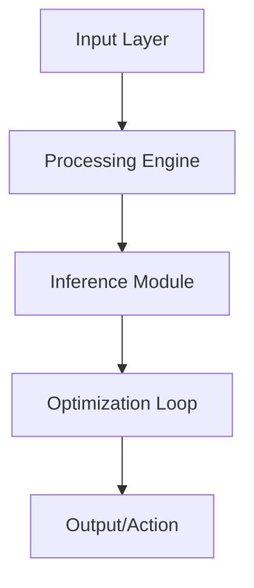

# 🤖 Autonomous Agent Core

[](LICENSE)
[](https://www.python.org/)
[](#)

Advanced decentralized core for autonomous AI agents with reasoning capabilities.

## 🏗️ Architecture



## 🌟 Key Features
- **Recursive Reasoning Loops**
- **Tool-Augmented Generation**
- **Distributed Agent Communication**

## 🛠️ Technology Stack
- `Python`
- `LangChain`
- `AutoGPT`
- `Redis`

## 🚀 Installation

```bash
git clone https://github.com/YannLeCun25/autonomous-agent-core.git
cd autonomous-agent-core
pip install -r requirements.txt
```

## 📂 Project Structure
```
├── src/            # Modular source code
├── tests/          # Unit & integration tests
├── docs/           # Technical documentation
├── requirements.txt # Dependency list
└── setup.py        # Package installation
```

Developed by **Yann LeCun** (Elite AI Engineer).
